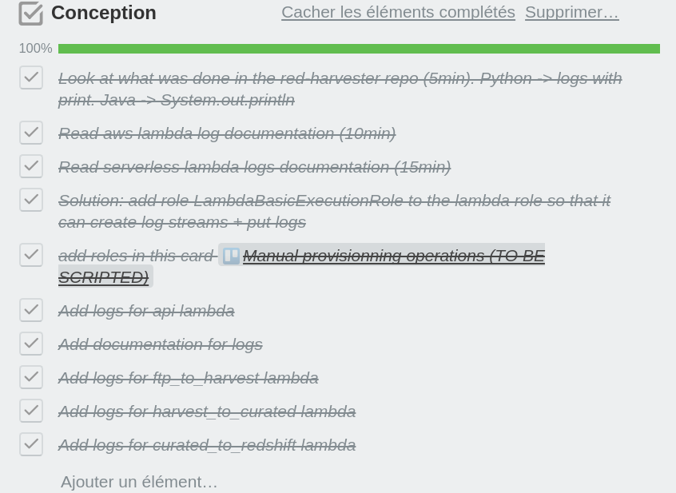
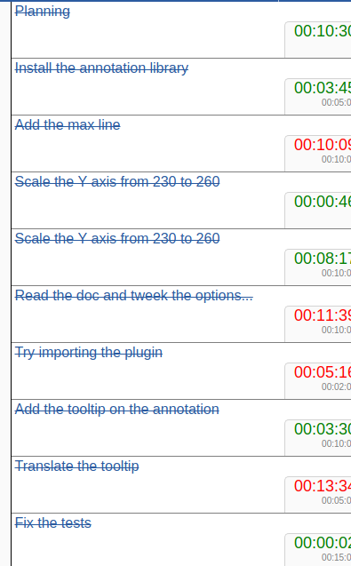

# [Standard] How to tackle tickets with conception phase (3 min)

### Owner: [Quentin Febvre](https://github.com/quentinf00)

## Why:

 - To detect problem earlier during the implementation of a ticket
 - To ensure vsibility on what is done during the implementation of a ticket

This can be a tool to reduce the lead time on features with uncertainties, the conception phase can be used to prioritize kanban ticket into you sprint

## Checks

 - I have detailed the ticket in tasks smaller than 15min
 - The tasks have been challenged by another dev of the team
 - The dev tracks the time spent on each tasks using this tool: https://theodo.github.io/workflow-monitor
 - If the ticket was underestimated, the dev call the PO and ask to prioritize more points
 - If the ticket is not done by the end of the day, the dev split it and put the number of points consumed to validate

## Bad example

## Good example

